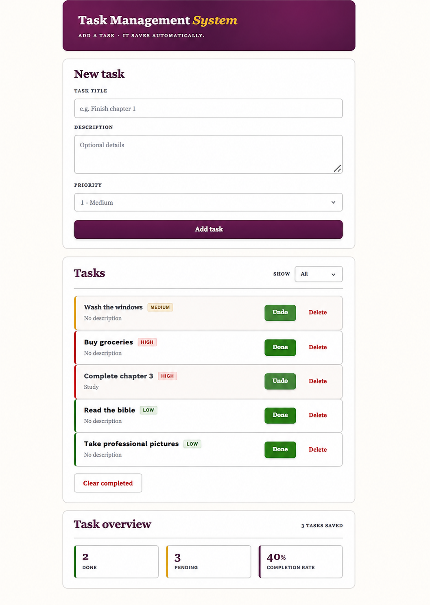
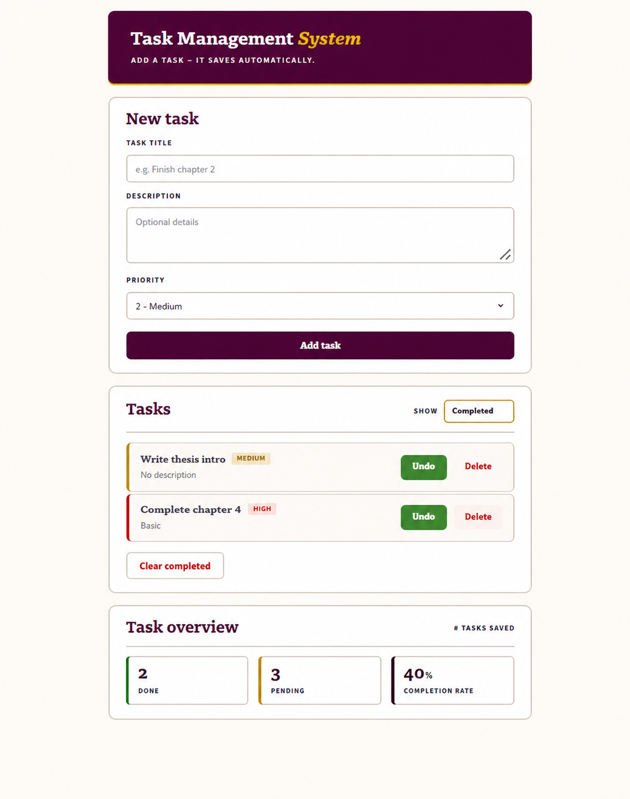
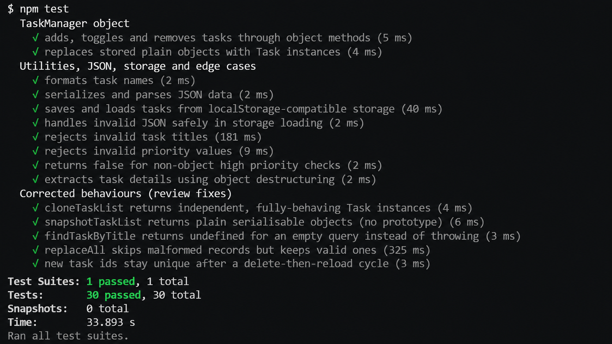
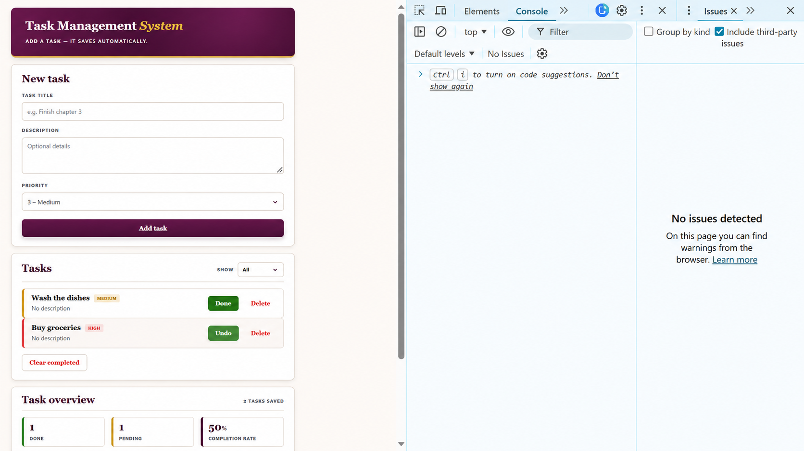

# Task Management System

**Capstone 2 — Debug Task Manager**

## Overview
A task management application rebuilt from an intentionally
broken starter (52 seeded errors) into a modular, validated, fully tested ES6+
codebase. Tasks can be created (title, description, priority), marked complete,
deleted, cleared in bulk, filtered, persisted to `localStorage`, and summarised
with done / pending / completion-rate statistics. Core logic is decoupled from
the DOM so it can be unit tested in isolation. **30 Jest tests pass, 0 failures.**


*App in the browser: form, filterable list, live statistics.*

## Errors Found (by category)
Full inventory with line numbers is in `issues-identified.pdf`.
1. `app.js:4` `taskList` declared with no keyword (implicit global).
2. `app.js:5,37` `var` declarations.
3. `app.js:57`, `utils.js:32` loose `==` comparisons.
4. `app.js:71` assignment `=` used inside an `if` condition.
5. `app.js:46` off-by-one `for` loop (`<=` reads past the array).
6. `app.js:56-60` `while` loop never increments `i` (infinite loop).
7. `app.js:52` `findTaskByTitle` omits its `title` parameter.
8. `app.js:109-117` recursion has no base case or null guard.
9. Average priority has no empty-array check (divide by zero).
10. `app.js:14` `Task` class has no `id` property.
11. `app.js:17` no `toggleCompletion` method.
12. `app.js:28` `SubTask` constructor omits `super()`.
13. `app.js:21` string concatenation instead of template literals.
14. `app.js:82-85` no object destructuring; `96-106` duplicated push loops.
15. `dom.js:6-7` selectors use wrong methods (`getElementById` with a class,
    missing `#`).
16. `dom.js:10` listener attached with no null check.
17. `dom.js:44-45` list container written twice via concatenation (duplicates).
18. `dom.js:67` init runs before the DOM loads; no event delegation.
19. `utils.js:8-15` storage functions skip `JSON.stringify`/`parse`.
20. `app.test.js` has no imports, no `beforeEach`, no edge cases.

## Fixes Implemented
- **Variables & operators:** every `var` → `let`/`const`; the undeclared global
  declared; all `==` → `===`; the `=`-in-`if` replaced with strict comparison.
- **Control flow:** off-by-one and infinite loops replaced with `for-of` and
  `Array.find`; conditionals given null/type guards.
- **Functions:** missing parameter restored; recursion given a base case and
  guard; pure and higher-order functions added.
- **OOP:** `id` and `toggleCompletion` added; real `super()` with an overridden
  `getInfo`; eleven `TaskManager` methods.
- **Modern JS:** four ES6 modules; object/array/parameter destructuring;
  template literals; spread and rest operators.
- **DOM:** corrected selectors; null checks; one delegated listener;
  `DOMContentLoaded`; HTML-escaped template-literal rendering.
- **Storage:** `JSON.stringify`/`parse` with guarded save/load/clear.
- **Error handling & quality:** parameter validation, `try-catch` at every I/O
  boundary, meaningful messages, comments, consistent 2-space indentation.

## Features Added (Modern JavaScript)
ES6 modules; classes with inheritance and `super()`; destructuring; template
literals; spread/rest; arrow functions; optional chaining;
`map`/`filter`/`reduce`/`find`/`some`/`every`/`sort`/`flat`; pure and
higher-order functions.

## How to Run the Application
The app uses ES6 modules, so serve `index.html` with a static server — the
**VS Code Live Server** extension ("Go Live") is simplest. No build step needed.


*DOM features: Completed filter, delegated buttons, updated stats.*

## How to Run the Tests
```bash
npm install
npm test
```
Tests run as native ES modules; `beforeEach` resets shared state.

**Result:** `Tests: 30 passed, 30 total` (0 failures), including edge cases:
empty title, invalid priority, malformed JSON, empty query, resilient reloads.


*Jest: 1 suite, 30 tests, 0 failures.*


*DevTools Console and Issues panels clear of errors.*

## Reflection
The hardest bugs were architectural, not syntactic. The `=`-vs-`===` error in
`updateTaskPriority` assigned inside the `if`, always evaluated truthy, and
"matched" the first task every time — only asserting against a non-existent id
exposed it. The missing `super()` failed loudly, but inconsistent priority typing
was insidious, fixed by committing to a single numeric 1–5 model normalised in
one place. Decoupling logic, utilities, storage and DOM is what made every fix
testable in Node without a browser.
